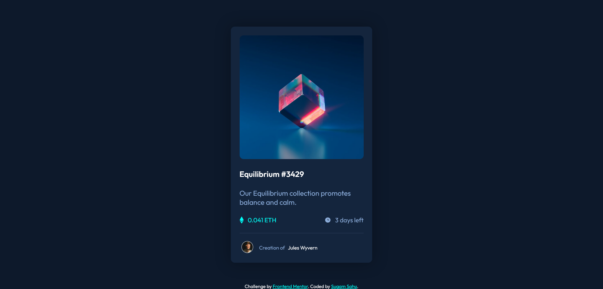

# Frontend Mentor - NFT preview card component solution

This is a solution to the [NFT preview card component challenge on Frontend Mentor](https://www.frontendmentor.io/challenges/nft-preview-card-component-SbdUL_w0U). Frontend Mentor challenges help you improve your coding skills by building realistic projects. 

### The challenge

Users should be able to:

- View the optimal layout depending on their device's screen size
- See hover states for interactive elements

## Screenshot

### Challenge Screenshots

### Solution Screenshots

### Links

- Solution URL: [Solution Repo](https://your-solution-url.com)
- Live Site URL: [Live Site](https://your-live-site-url.com)

## My process

### Built with

- Semantic HTML5 markup
- CSS custom properties
- Flexbox
- CSS Grid

### What I learned

How to Make a Perfect Website Using Only Screenshots and No Figma File.

### Continued development

As it's still not pixel perfect, I am still going to develop till I can create pixel perfect websites just from screenshots.

## Author

- Website - [Sugam Sahu](https://www.sugamsahu.com)
- Frontend Mentor - [@yourusername](https://www.frontendmentor.io/profile/iSugam)
- LinkedIn - [sugam-sahu](https://www.linkedin.com/in/sugam-sahu/)